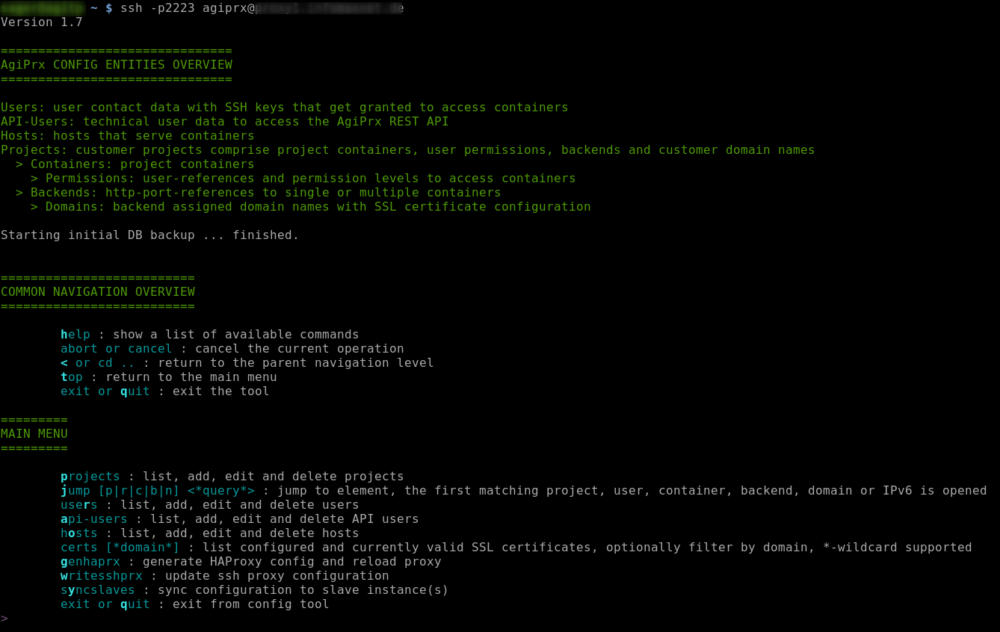
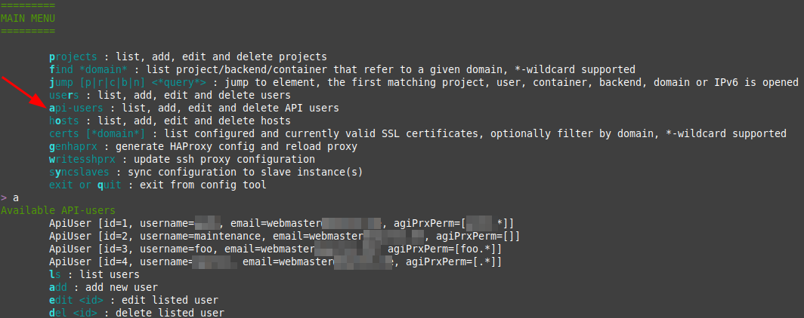

# AgiPrx - HAProxy configuration CLI and SSH Proxy config tool

Manage thousands of domains, HAProxy backends and server/virtual machine/container references by a SQL based CLI tool and generate an extensive HAProxy and SSH proxy configuration.

## Outline

Think about you have thousands of domain names to administer, lots of internal servers/virtual-machines/containers that serve web-content for these domain names. You need to get SSL certificates assigned and updated for these domains. You need to manage those domain names in groups/projects and be able to silently switch those groups from old server:port to a new server:port without external disturbance. And think about you want to additionally manage SSH/SFTP user accounts including SSH public keys that should be assigned to certain backends and switched over silently while user access data from the outside remains the same. And think about you like to give some self service to your advanced users / DevOps that like to be able to administer their systems by their own, e.g. assign domain names, replace external certificates or create new HAProxy backends. And think about you like to offer services from your internal (IPv6 only) network to the outside world by IPv4.
Then you get an idea what AgiPrx can be used for:



## Features

- management of HAProxy backends, domain names and server/virtual machine/container references: this facilitates the management in a multi-customer, multi-project, multi-backend and multi-domain environment (e.g. serving hundreds of customers and thousands of domain names via HAProxy)
- IPv4 to IPv6 gateway for web services and SSH access
- SSL certificate management: automated Let's Encrypt cert issuance and renewal, timely cert renewal notifications for individually requested certificates
- optional customer SSH permission management: configuration of a SSH proxy setup with tunneling to the target servers/containers; this way customer credentials and servernames remain stable even if internal systems are reorganized; customer connections via e.g. **ssh customerx-prod_www-data@proxy.example.org** are internally routed by the combined information from the username.
- user management: AgiPrx-admin and customer contact and SSH public key administration
- search functionality to jump into specific user/project/container/backend/domain configuration
- configuration in SQL database: run mass-updates with SQL
- archiving of configuration before and after configuration changes
- safe HAProxy-reload / fallback to last configuration in case of errors
- REST interface for mass-domain updates on backends (may be extended upon request)
- no config interference: manual configuration of HAProxy or system users can co-exist besides generated configuration; AgiPrx can be removed and the generated configuration continues to work independently
- optional master-slave setup with multiple slave servers: all configurations including database and certificate data can be synchronized to slave servers to prevent a SPOF regarding AgiPrx, HAProxy and the SSH Proxy setup

## Console Screenshot



## Master-Slave-Setup

In the optional master-slave setup AgiPrx instances are configured with one master and 1..n slaves: all configurations including database and certificate data can be synchronized to slave servers via a sync-command after a configuration change to prevent a single point of failure regarding AgiPrx, HAProxy and the SSH Proxy setup.
The slave instances can be used as failover or active frontend servers for HAProxy and the SSH access. See [Master-Slave Setup and Failover instructions](https://github.com/usrflo/agiprx-setup/blob/master/Setup-Production.md#optional-master-slave-setup).



## Usage Instructions

### Add Hosts

Hosts are used as logical units that contain containers (e.g. virtual machines, application or system containers or services on the host system itself).
These logical units can be used to select all containers/backends that fail if the host system went down. Hosts need to be configured in the first step.

### Add Users

Users need to be added with

* fullname, e.g. 'Florian Sager', 'Generic Customer', 'Deployment User X'
* email address for sending out notifications like account data or admin error messages on batch processing
* valid SSH key
* role:
    * ADMIN: full access to AgiPrx
    * USER: limited access to AgiPrx
        * without user, host and API administration
        * without search functionality (may be allowed in the future)
        * limited to a configured set of projects via 'AgiPrx project permissions', see below
    * CONTACT: user has not access to AgiPrx
 * default technical user permission in target environments/containers. A list of e.g. 'root,www-data' allows to access the target environment by root and www-data by default if added by a 'groupadd' command (see below).

### Create new Project, Container, Permissions, Backend and Domain

There is an initial setup wizard to configure a new container with SSH access and HAProxy backend configuration [TODO]

### Configure multiple Backends per Container

[TODO]

### Configure hot-standby Container

[TODO]

### Sync configuration to Slave AgiPrx-Servers

A manual sync can be triggered by the 'syncslaves' command from the main menu.

An automatic sync is triggered at the end of every maintenance job execution.

## Setup and System Requirements

### Packages

- MariaDB
- openssl
- certbot
- cron
- AgiPrx deployment via ansible: AgiPrx comes with a custom reduced Java11-JRE

### Hardware

- Small setup: 130M of reserved RAM
- Large setup with >300 backends, >2600 SSL certificates, >7000 domains: 260M of reserved RAM

### Setup Instructions

See repository [AgiPrx-Setup](https://github.com/usrflo/agiprx-setup) for an automated deployment by ansible.

### HAProxy defaults

See and adapt [etc/haproxy/haproxy-header.cfg](etc/haproxy/haproxy-header.cfg) and [etc/haproxy/haproxy-footer.cfg](etc/haproxy/haproxy-footer.cfg) to suffice your needs.
The HAProxy configuration file generator combines haproxy-header.cfg, an auto-generated backend list and haproxy-footer.cfg to a haproxy.cfg target file that is validated before a HAProxy reload is executed.
A generated backend contains a redirect from HTTP to HTTPS in case a SSL certificate is configured and available.

### SSH Proxy defaults

The AgiPrx instance(s) use a configured private SSH key to access target environments on proxied connections. It's the task of the administrator to assure that the according
public SSH key is authorized on the target environments. Currently there is a single SSH key used for all target environments. Although functionally not required there is
potential to extend AgiPrx to use several private keys in the proxy setup and choose the required key on each permission configuration.

### Maintenance Job

The maintenance job should be executed once a day to

 * check if IPs of productive domain names are equal to the proxy IPs, otherwise inform about DNS issues
 * check if configured certificates will reach end-of-life in configured notification period for domains not in error, notify in case of end-of-live
 * generate Let's Encrypt certificates if configured and not available for domains not in error state + renew existing certs
 * generate new SSL certificate mappings
 * sync to slave instances if defined

The maintenance job can be either triggered via SSH command or via the AgiPrx API. See details in [Setup-Production](https://github.com/usrflo/agiprx-setup/blob/master/Setup-Production.md).

## REST-Interface

### Implementation

Package of the REST service implementation: [src/main/java/de/agitos/agiprx/rest](src/main/java/de/agitos/agiprx/rest)

Definition by OpenAPI 3, see [src/main/resources/META-INF/openapi.yml](src/main/resources/META-INF/openapi.yml) or http(s)://[host]:8002/openapi

### Operations

```
GET /test/ping
test api availability

GET /test/authping
test api availability and user authentication

GET /admin/gensynchaprx
generate config, reload HAProxy and synchronize the config to slave servers

GET /admin/writesshprx
generate SSH proxy config

GET /domains/{projectLabel}
get configured domains inside a project

GET /domains/{projectLabel}/{backendLabel}
get configured domains inside a backend of a project

POST /domains/massupdate
partial or full update of domains inside a project

GET /projects
fetch all projects the user has access to

GET /projects/{projectLabel}
fetch project details

POST /containers/{projectLabel}
create or update container in project

POST /backends/{projectLabel}
create or update backend in project

PATCH /backends/{projectLabel}/{backendLabel}/setContainersOf/{targetBackendLabel}
switch backend containers of a backend to those of another backend

GET /maintenance/start
Start maintenance process to check/renew SSL certificates
```

### API via TLS

To configure access to the ApiPrx-API via https create a new backend with target port 8002 that is linked to a container configuration for ipv6 [::1].
Configure a long timeout 'timeout server 240000' as HAProxy param in the backend configuration.

As a result the generated backend section inside haproxy.cfg will look like:

```
backend agiprx_123_api
        timeout server 240000
        redirect scheme https if !{ ssl_fc } { req.hdr(host),lower,map_str(/etc/haproxy/domain2cert.map) -m found }
        server agiprx-server.my.tld_agiprx-api [::1]:8002
```

### API-Access

The access to the API is granted to api users configured by admin users in the main menu entry 'api-users'; there is an optional limitation to specific projects by a list of project labels (wildcards can be used).



## TODO List

- configurable AgiPrx-API port (it's currently fixed to port number 8002)
- run AgiPrx as non-root: assure that HAProxy can be reloaded by sudo permissions, assure that AgiPrx can create/update/remove local system users by sudo permissions, assure that certbot can create Letsencrypt certificates with limited permissions, assure that slave proxy sync can be executed without root permissions
- USER role: remove permission to assign any ip address to containers to prevent foreign container access inside the group of configured users if default SSH key is used internally
- add optional editing of individual user-specific SSH private keys in permission handling (replacement of default SSH key)
- add audit tables to track changes to the database
- add simple HTTP basic authentication administration and assignment to HAProxy backends
- remove [LXD/LXC](https://linuxcontainers.org/) references (AgiPrx can be used independently from LXD)
- copy functionality, e.g. copy user permissions from one container setup to another
- optional support of longer usernames that may become long because of projectlabel-containerlabel_techusername, see https://serverfault.com/a/1043812
- add unit tests: there are currently only a handful of tests with no noteworthy code coverage

## Licenses

AgiPrx is licensed under [GNU GPLv3](https://opensource.org/licenses/GPL-3.0).

Package de.agitos.agiprx.db.* contains a modified version of [Spring JDBC](https://github.com/spring-projects/spring-framework/tree/master/spring-jdbc), its license is [Apache License v2.0](https://www.apache.org/licenses/LICENSE-2.0).
